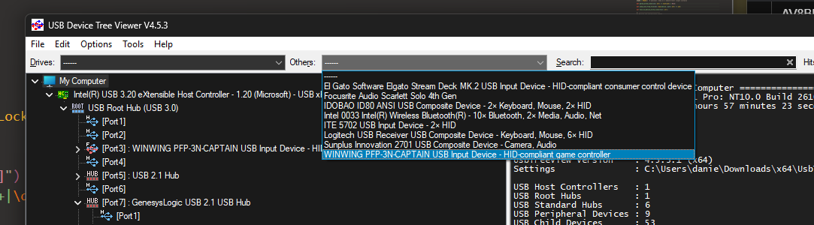
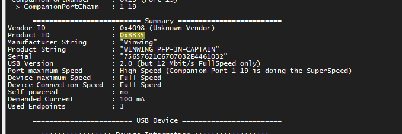

# Open FLight panel

An open source library for interfacing with WinWings PFPs
Copyright (c) 2025 Kurisu003

This software is licensed under the PolyForm Noncommercial License 1.0.0.
You may use, copy, modify, and distribute this software for any noncommercial purpose,
provided that you give appropriate credit to the original author.
For full license text, see: https://polyformproject.org/licenses/noncommercial/1.0.0/

# The basics

## who helped

A huge shoutout goes to https://github.com/alha847/winwing_mcdu and https://github.com/vradarserver/cduhub/tree/main/library/mcdu-dotnet/WinWing/Mcdu for indirectly helping by me looking at their GitHub

## How it works (I think)

1. "Init" packet is send to the PFP to put it into (what I'm calling) "text-mode". Sending text to it right away wont work. This package is a wireshark USB capture of winwings demo mode in SimApp Pro. </br> If anyone knows more information on this, it would be greatly appreciated.
2. (What I'm presuming are) Bitmaps of the font, are sent to the device. However I do not know how these are interpreted exactly and thus cant make custom fonts (yet). Again, any info on this would be greatly appreciated
3. Once the init-packet and bitmaps are sent, the panel is ready to recieve text. </br>Text is formatted by 128 Hex bytes. The first 2 always being F2, followed by 126 bytes formatted as ABCD EF, where ABCD are for color and fomatting and EF are the ascii bytes in hex.
4. The color is formatted as follows:</br>

```
fg_lookup = {
    "orange": 0, "white": 1, "cyan": 2, "green": 3,
    "magenta": 4, "red": 5, "yellow": 6,
}
bg_lookup = {
    "black": 0, "green": 1, "gray": 2, "orange": 3, "purple": 4,
}

prefix_byte = 0x21 + 0x21 * fg_lookup["white"] + 0xC * bg_lookup["black"]

actual_byte = [prefix_byte, 0x00, ascii_byte]
```

## How to use it (aka. what you're probably here for)

First of all youre going to need to `pip install re` & `pip install hid`.
For now it's a python class, that you initialize can use as shown in "example.py".
To get your vendor ID (VID) and product ID (PID) you can use a tool like https://www.uwe-sieber.de/usbtreeview_e.html



## Where do we go from here?

This is just the beginning. Im already working on a full suite of tools, including (but not limited to) DCS integration with DCS Bios, a custom mode for DCS where you can input RWR codes and it shows you information about whats targeting you and much much more.</br>
Free and open source software is near and dear to my heart, so all of that will be made public by me ofcourse
